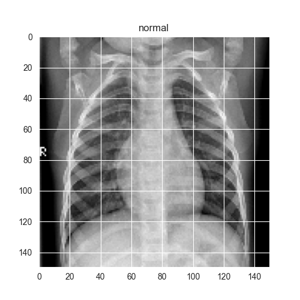
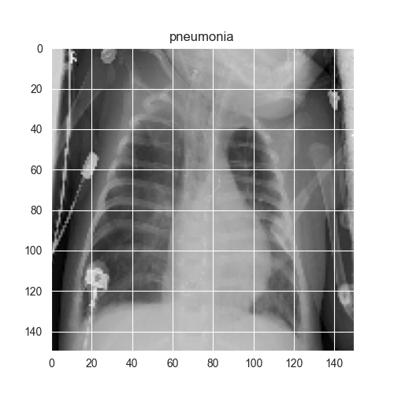
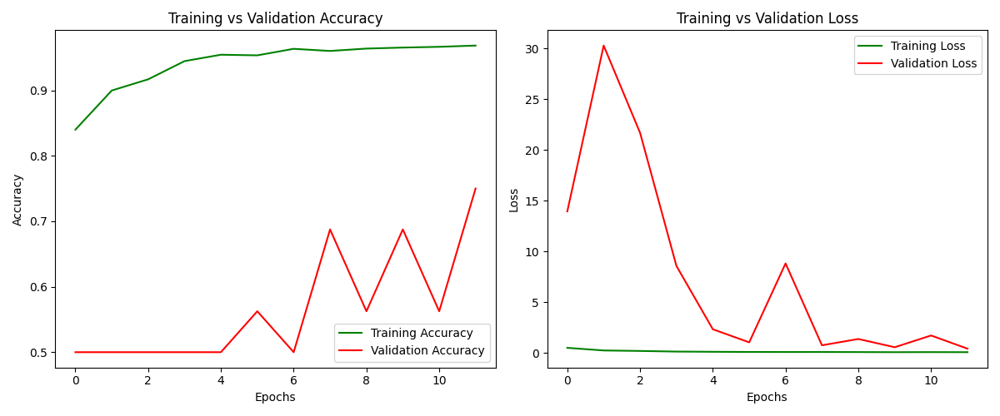
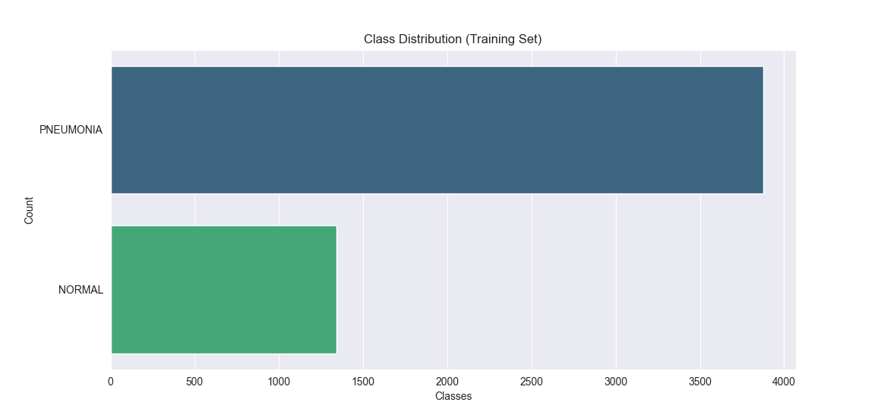

# Pneumonia X-ray Detector (CNN)

A deep learning project to detect **Pneumonia** from chest X-ray images using a **Convolutional Neural Network (CNN)**.

This project has:
- **Frontend** (HTML, CSS, JS) → inside the `frontend` folder for remote access.
- **Backend API** (Flask) → for predictions.
- **Streamlit Deployment** → a standalone web app for easy usage without dealing with CORS issues.

---

## Live Demo
- **Streamlit Deployment:** [https://czgk8ceahwswtw2wmd97x3.streamlit.app](https://czgk8ceahwswtw2wmd97x3.streamlit.app)  
  *(Click to open the deployed app and try it live)*

- **Frontend + Backend Setup:**
  - Frontend folder: `/frontend`
  - Backend served on: `https://pneumonia-x-ray-detector-cnn.onrender.com`

---

## Dataset
The dataset used is from **Kaggle**:  
[Chest X-Ray Images (Pneumonia)](https://www.kaggle.com/datasets/paultimothymooney/chest-xray-pneumonia)

# Dataset Structure:
dataset/
│
├── train/
│ ├── NORMAL/
│ └── PNEUMONIA/
│
├── test/
│ ├── NORMAL/
│ └── PNEUMONIA/
│
└── val/
├── NORMAL/
└── PNEUMONIA/


- **NORMAL** → X-rays without pneumonia.
- **PNEUMONIA** → includes bacterial and viral pneumonia images.

---

## 🧠 CNN Model Architecture
We used a custom CNN with **5 convolutional layers**.  
The model was trained using TensorFlow and Keras.

| Layer Type        | Filters / Units | Activation | Notes |
|-------------------|-----------------|------------|-------|
| **Conv2D**        | 32              | ReLU       | Input shape (150, 150, 1) |
| **MaxPooling2D**  | 2x2             | -          | Downsampling |
| **Conv2D**        | 64              | ReLU       | + Dropout (0.1) |
| **MaxPooling2D**  | 2x2             | -          | Downsampling |
| **Conv2D**        | 64              | ReLU       | - |
| **MaxPooling2D**  | 2x2             | -          | Downsampling |
| **Conv2D**        | 128             | ReLU       | + Dropout (0.2) |
| **MaxPooling2D**  | 2x2             | -          | Downsampling |
| **Conv2D**        | 256             | ReLU       | + Dropout (0.2) |
| **MaxPooling2D**  | 2x2             | -          | Final pooling |
| **Flatten**       | -               | -          | Flatten output |
| **Dense**         | 128             | ReLU       | Fully connected |
| **Dropout**       | 0.2             | -          | Prevent overfitting |
| **Dense** (Output)| 1               | Sigmoid    | Binary classification |

---

## 📊 Model Performance
The model was trained for **12 epochs** with data augmentation applied to prevent overfitting.

| Metric          | Value |
|-----------------|-------|
| **Accuracy**    | 92.46% |
| **Loss**        | 0.27 |

---

## 📝 How It Works
1. **Input:** User uploads a chest X-ray image.
2. **Preprocessing:**
   - Image is converted to grayscale.
   - Resized to **150x150 pixels**.
   - Normalized to the range `[0, 1]`.
3. **Prediction:** The trained CNN model classifies the image as:
   - `NORMAL`
   - `PNEUMONIA`
4. **Output:** Displays the prediction and confidence score.

---

## 🌐 Project Flow
1. **Frontend (HTML/CSS/JS)**  
   - Simple interface for uploading chest X-ray images.
   - Sends the image to the backend API for prediction.

2. **Backend (Flask)**  
   - Handles requests from the frontend.
   - Runs the trained CNN model (`pneumonia_model.h5`).

3. **Streamlit App**  
   - Standalone web app combining frontend and backend.
   - Deployed on **Streamlit Cloud** for easy sharing.

---

## 🚀 Deployment
### **Frontend + Backend:**
- **Backend:** Render (`Flask` + `Gunicorn`)
- **Frontend:** Vercel (Static HTML, CSS, JS)

### **Streamlit Deployment:**
- **Host:** Streamlit Community Cloud
- **Link:** [https://your-app-name.streamlit.app](https://your-app-name.streamlit.app)

---

## Screenshots
Below are placeholders for four images. Replace them with actual screenshots later.

| Sample image(normal) | Sample image(pneumonia) | Training vs Validation | Data Distribution |
|--------------|-------------------|------------------------|------------------|
|  |  |  |  |

---

## Tech Stack
- **Python** (TensorFlow, Keras, NumPy, Pillow)
- **Flask** (Backend API)
- **Streamlit** (Final Deployment)
- **HTML, CSS, JS** (Frontend UI)
- **Render** (Backend hosting)
- **Vercel** (Frontend hosting)

---

## Running Locally
1. Clone the repo:
   ```bash
   git clone https://github.com/<your-username>/Pneumonia-X-ray-Detector-CNN.git
2. Navigate into the project folder:
   ```bash
   cd Pneumonia-X-ray-Detector-CNN
3. Install dependencies:
   ```bash
   pip install -r requirements.txt

4. Run the Streamlit app:
   ```bash
   streamlit run streamlit_app.py

## Author
# Arjjun S
Building solutions in deep learning and computer vision with a focus on real-world applications.
